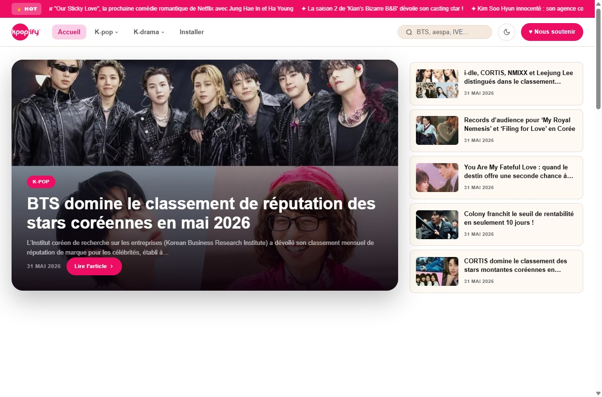

# mworago 2026

Thème WordPress multilingue pour [mworago.me](https://fr.mworago.com) — actualités K-pop et K-drama en 14 langues.

Développé par [Breizhzion](https://breizhzion.fr).




## Sites déployés

| Site | Langue |
|------|--------|
| mworago.me | Français |
| beta.mworago.com | Français (beta) |
| es.mworago.com | Español |
| de.mworago.com | Deutsch |
| it.mworago.com | Italiano |
| ko.mworago.com | 한국어 |
| en.mworago.com | English |
| ph.mworago.com | Filipino |
| pt.mworago.com | Português |
| ms.mworago.com | Bahasa Melayu |
| ar.mworago.com | العربية |
| vi.mworago.com | Tiếng Việt |
| th.mworago.com | ภาษาไทย |
| id.mworago.com | Bahasa Indonesia |

## Structure

```
mworago-2026/
├── style.css               — déclaration thème + CSS global
├── functions.php           — enqueue styles/scripts, register menus, theme mods
├── header.php / footer.php — layout principal
├── front-page.php          — page d'accueil
├── home.php                — liste des articles
├── single.php              — article individuel
├── archive.php             — archives catégorie/tag
├── page.php                — page statique
├── page-comebacks.php      — page Comebacks (JSON mworago)
├── page-dramas.php         — page Dramas
├── page-top-charts.php     — page Top Charts K-pop
├── page-top-airing.php     — page Top Dramas en cours
├── search.php              — résultats de recherche
├── 404.php                 — page d'erreur
├── assets/
│   ├── css/                — styles composants
│   └── js/                 — dark mode toggle, scripts
└── languages/              — fichiers .po/.mo (14 langues)
```

## Charte graphique

- Rose brand : `#ED0E64`
- Typographie : DM Sans
- Light/dark mode via `data-theme` sur `<html>`

## Traductions

Fichiers `.po` dans `languages/`. Compiler les `.mo` dans le container Docker :

```bash
docker exec mworago-es-wp wp i18n make-mo \
  /var/www/html/wp-content/themes/mworago-2026/languages/ --allow-root
```

## Déploiement

Voir la documentation interne : `docs/services/mworago-deploy-theme.md`

## Licence

Propriétaire — Breizhzion. Tous droits réservés.
